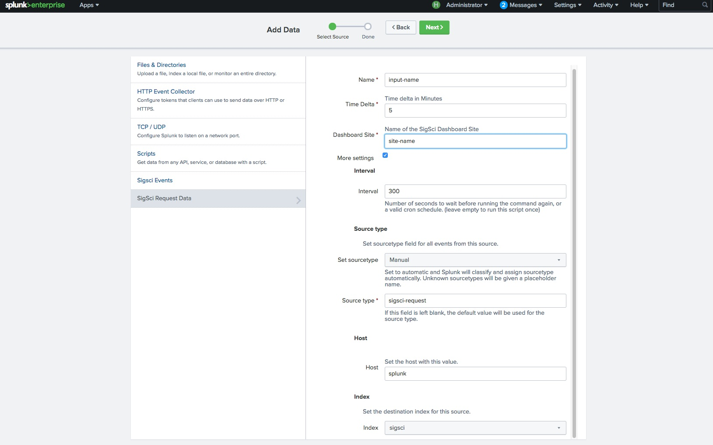
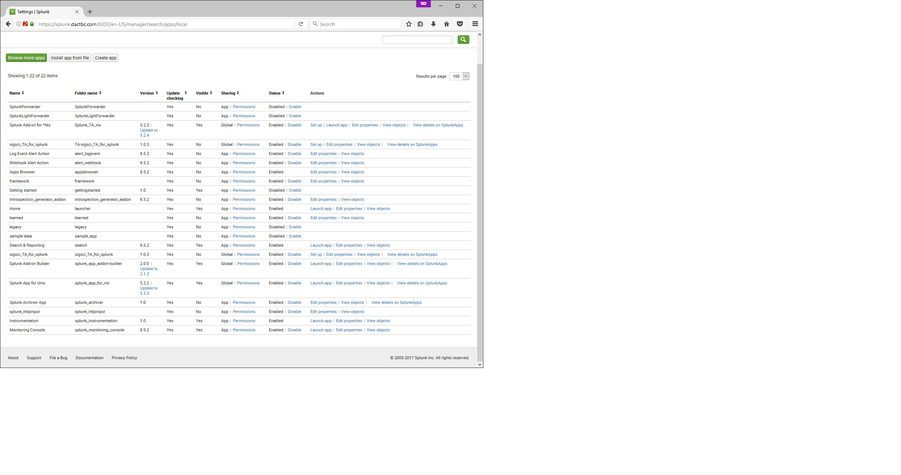
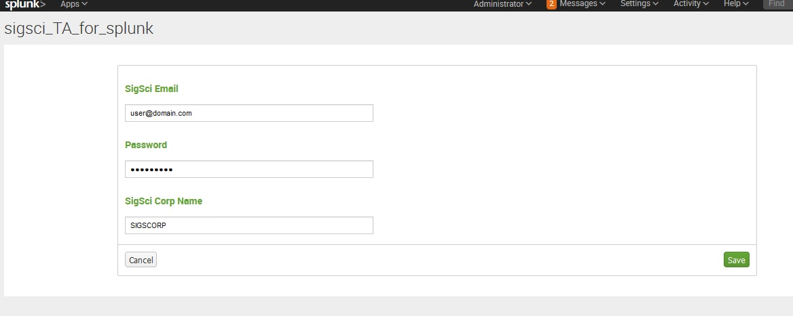
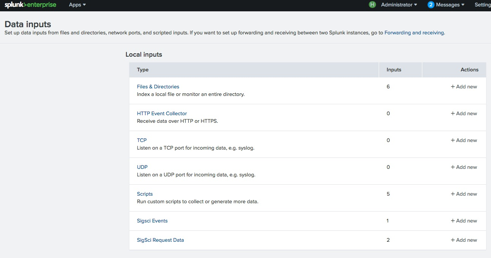
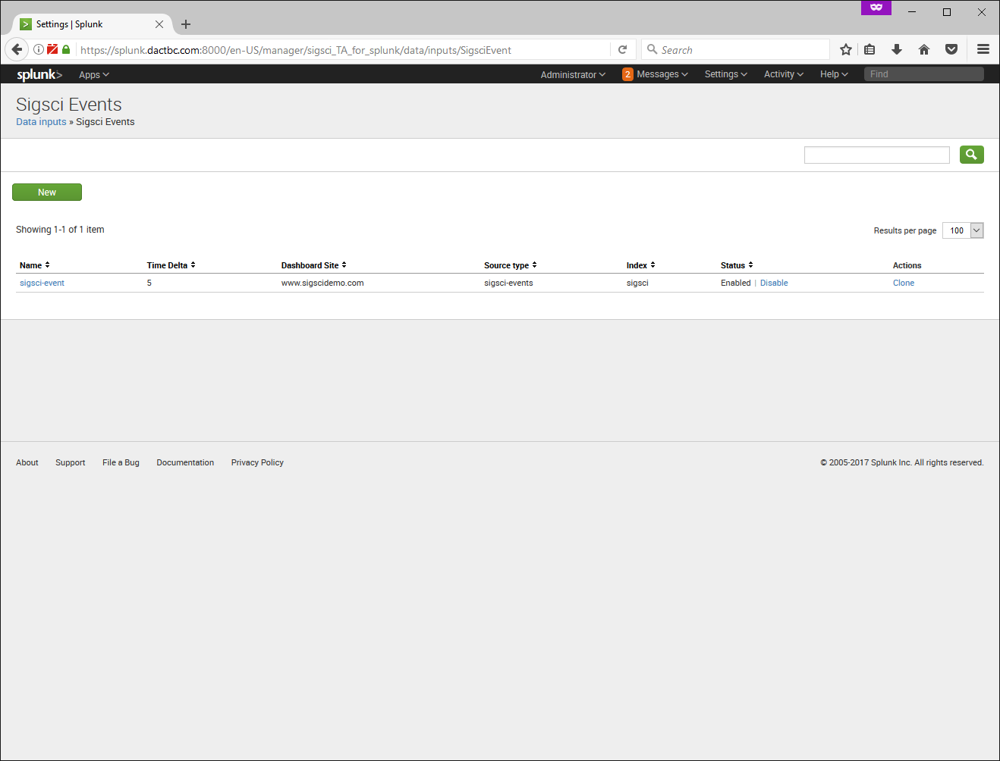
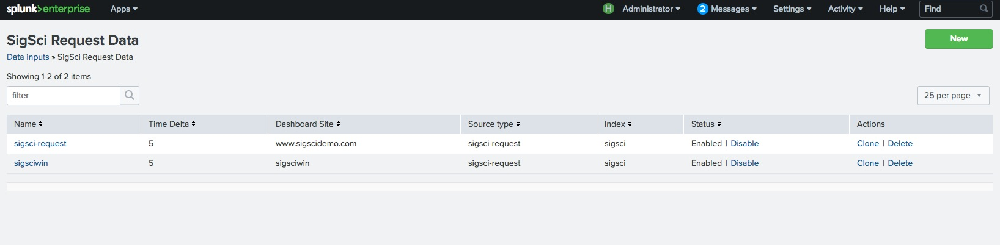
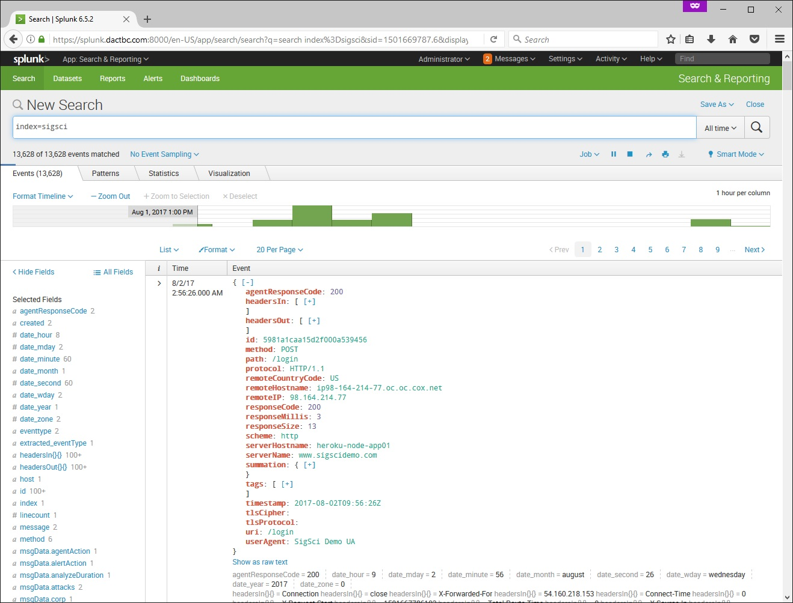

# Signal Sciences TA for Splunk App

This app for Splunk connects to the Signal Sciences API in order to pull data into Splunk. 

## Signal Sciences REST API Endpoints used

1. https://dashboard.signalsciences.net/api/v0/auth
2. https://dashboard.signalsciences.net/api/v0/corps/{{corp}}/sites/{{site}}/analytics/events
2. https://dashboard.signalsciences.net/api/v0/corps/{{corp}}/sites/{{site}}/feed/requests

## Indexes

The Technical Adapter does not create an index by default. The Data inputs do default to an index named `sigsci`. If this index does not exist you will either need to create it or in the more settings of the data inputs specify an index that does exist.

## Where to get API Information?

The Corp name and Site names are in the URL for the dashboard. For example if we had a API name of `foo` for the corp and a dashboard api name of `bar` we would see it like the following:

`https://dashboard.signalsciences.net/corps/foo/sites/bar`

You can also get the API Name for Dashboard Sites from the Manage Sites menu if you are a Corp Owner or Corp Admin. When logging into the Signal Sciences Dashboard you can go to `Corp Tools` -> `Manage Sites` and the lowercase name under the display name is the API Name.

In version 1.0.17 you can use API Tokens instead of using a password. If both the password and API Token fields are filled in the App will use the API Token field and the password will be ignored. One of these are required.

Information about API Tokens can be found at https://docs.signalsciences.net/using-signal-sciences/using-our-api/#creating-personal-api-tokens

## Configuration

Once the Splunk App has been installed you will need to configure the shared settings and then the Modular Data inputs.

1. Log into the Splunk Web Portal and go to the Apps -> Manage Apps section
2. Select Setup for the sigsci_TA_for_splunk app

    

3. Specify the Signal Sciences user (Email Address), Password, and your Signal Sciences corp name

    

4. After clicking save got to Settings -> Data Inputs

    

5. First Select the SigSci Events Data input. There will be a default event called sigsci-event. You can modify this or create a new entry for each dashboard site you want to monitor in your Signal Science corp.
6. After saving click enable for the SigSci Event entry

    

7. Go back to the Settings -> Data Input
8. Select the SigSci Request Data input
9. There will be a default event called sigsci-request. You can modify this or create a new entry for each dashboard site you want to monitor in your Signal Science corp. The Time Delta is in minutes and isn't recommended to do more than 1 hour. Generally 5 minutes is a good starting interval.

    
 
10. Once you click save you can go to Apps -> Search & Reporting
11. To do an initial search you can search for `index=sigsci`

    

