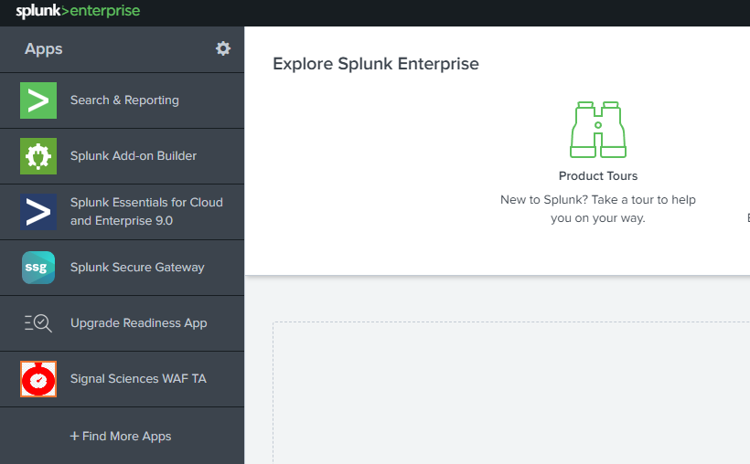

### Supportability notice 📖  
This TA app is considered open source and **has no official SLA**. If you are experiencing issues with the app itself please raise an issue via github issues instead of contacting fastly support. Otherwise, if you are experiencing issues with the API itself, please raise an issue via support@fastly.com

# Signal Sciences TA for Splunk App

This app for Splunk connects to the Signal Sciences API in order to pull data into Splunk. 

## Signal Sciences REST API Endpoints used

The latest version **only** supports using API Tokens. 

Information about API Tokens can be found at https://docs.signalsciences.net/developer/using-our-api/

1. https://dashboard.signalsciences.net/api/v0/corps/{{corp}}/sites/{{site}}/analytics/events
2. https://dashboard.signalsciences.net/api/v0/corps/{{corp}}/sites/{{site}}/feed/requests
3. https://dashboard.signalsciences.net/api/v0/corps/{{corp}}/activity

## Where to get API Information?

The Corp name and Dashboard Site names are in the URL for the dashboard. For example if we had a Corp Name of `foo` and a Dashboard Site name of `bar` we would see it like the following:

`https://dashboard.signalsciences.net/corps/{CORP_NAME}/sites/{site_api_name}`

You can also get the API Name for Dashboard Sites from the Manage Sites menu if you are a Corp Owner or Corp Admin. When logging into the Signal Sciences Dashboard you can go to `Corp Tools` -> `Manage Sites` and the lowercase name under the display name is the API Name.

## Indexes

The Technical Adapter does not create an index by default.

## Configuration 1.0.27 or higher

Once the Splunk App has been installed you will need to configure the shared settings and then the Modular Data inputs.

1. Log into your Splunk Web Portal
2. Select the sigsci_TA_for_splunk

   
    
3. Click on "Configuration"
4. Click on "Add-on Settings"
5. Fill in the Signal Sciences user (Email Address), Password or API Token, and the Singal Sicences corp name.

   * **Email Address:** This is the username/email address for the Signal Sciences dashboard
   * **API Token:** This is required and should be a token associated with your e-mail address
   * **Corp Name** This is the API id for the corp, often if your Display Name for the corp is "Corp ABC" the API Name might be something like `corp-abc`

   

6. Click Save
7. Click on "Input"
8. Click on "Create New Input"

   

9. Chose either "Sigsci Requests" or "Sigsci Event"
10. Fill in the Input settings

    * **Name:** This is the unique name you would like to give the input
    * **index:**  This is the index that will store the data on splunk, you can use `default`
    * **Time Delta in Seconds:** This is the time period, in seconds, that the script will pull. This should generally be left at the default which is 300 and matches the interval for the input.
    * **Interval:** This is the interval frequency the script runs in, in seconds. This should be the same as the delta and is recommended to leave at 300
    * **Site API Name:** This is the API Name for the dashboard it could be something like `app-prod`

   

## Updating the App

The new process for updating the App is to:

1. Install the Splunk App builder
2. Select the App Builder
3. Click "Import Project"
4. Use the latest `sigsci_TA_for_splunk_*_export.tgz` file in  "Export Folder"
     "Import the Splunk App"

### General App Properties

1. Open the Splunk App Builder
2. Click on properties
    "Select app properties"
3. Make any changes and hit change
    _IMPORTANT NOTE: changing the Add-on Folder Name could cause users to need to install the app fresh instead of upgrading_
     "Update App Properties"

### App Input Configuration

1. Open the Splunk App Builder
2. Click on the App Tile
3. Click on Configure Data Collection
4. Click on edit for the desired input

**Data Input Properties**
These are general properties for the input

 "Data Properties"

| Property            | Description                                                           |
|---------------------|-----------------------------------------------------------------------|
| Source Type Name    | The name of the input that will be used in searches. Can't be changed |
| Input display name  | The Display Name for the input                                        | 
| Input Name          | The API Name for the input                                            |
| Description         | The description is optional                                           |
| Collection Interval | The frequency the Modular Input is executed by the Splunk Server      |
   
**Data Input Parameters**
These are properties for the specific Modular Input

 "Data Parameters"

| Property      | Description                                                                                     |
|---------------|-------------------------------------------------------------------------------------------------|
| time_delta    | The time delta in seconds used by the modular input                                             |
| site_api_name | For the non-corp API configurations (SigsciEvents and SigsciRequests) this is the Site API Name |

**Add-on Setup Parameters** 
These are the global properties shared between all of the input types
 "Global Properties"

| Property      | Description                                    |
|---------------|------------------------------------------------|
| email         | The email for the API user to be used          |
| corp_api_name | The API name for the corp to pull data from    |
| api_token     | The API token for th account to pull data from |

Once Finished click Save and Finish

### Manage Source Types
The Manage source Types is used to configure how the input parses different properties of what is returned. This is configured to be JSON with specific criteria to find the timestamp.
 "Source Type Details"

Once you are done updating click save

## Exporting Splunk App Builder Package and Splunkbase Packages

**Export App for using in a new Splunk App Builder**
1. Open the Splunk App builder
2. Click the properties for the Signal Sciences WAF TA
3. Update the Version
4. Save the changes
5. Click Export. This file will be the new version of the `.tgz` file that you will need for importing on a new Splunk setup to use it in the App Builder

**Export App to Submit to Splunk Base**
1. Click Validate & Package
2. Click Validate
3. Once validation is completed click Download Package
4. Log into Splunkbase
5. Go to App Management
6. Select the App
7. Click New Version
8. Upload the new `.spl` file
