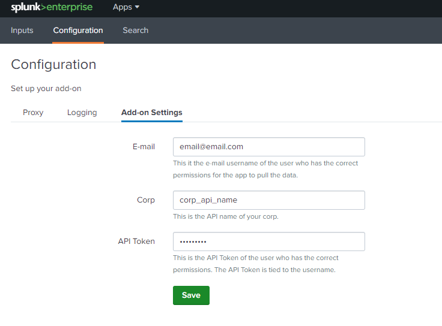
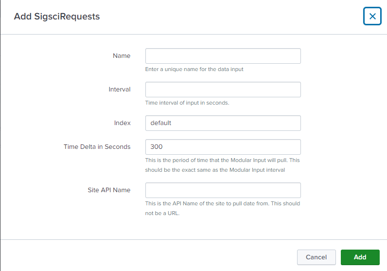

# Signal Sciences TA for Splunk App

This app for Splunk connects to the Signal Sciences API in order to pull data into Splunk. 

## Signal Sciences REST API Endpoints used

1. https://dashboard.signalsciences.net/api/v0/auth *(Only used if using Password authentication instead of APITokens)*
2. https://dashboard.signalsciences.net/api/v0/corps/{{corp}}/sites/{{site}}/analytics/events
2. https://dashboard.signalsciences.net/api/v0/corps/{{corp}}/sites/{{site}}/feed/requests

## Where to get API Information?

The Corp name and Dashboard Site names are in the URL for the dashboard. For example if we had a Corp Name of `foo` and a Dashboard Site name of `bar` we would see it like the following:

`https://dashboard.signalsciences.net/corps/foo/sites/bar`

You can also get the API Name for Dashboard Sites from the Manage Sites menu if you are a Corp Owner or Corp Admin. When logging into the Signal Sciences Dashboard you can go to `Corp Tools` -> `Manage Sites` and the lowercase name under the display name is the API Name.

In versions 1.0.17+ you can use API Tokens instead of using a password. If both the password and API Token fields are filled in the App will use the API Token field and the password will be ignored. One of these are required.

Information about API Tokens can be found at https://docs.signalsciences.net/developer/using-our-api/

## Indexes

The Technical Adapter does not create an index by default. The Data inputs do default to an index named `sigsci`. If this index does not exist you will either need to create it or in the more settings of the data inputs specify an index that does exist.

## Configuration 1.0.18 or higher

Once the Splunk App has been installed you will need to configure the shared settings and then the Modular Data inputs.

1. Log into your Splunk Web Portal
2. Select the sigsci_TA_for_splunk

   
    
3. Click on "Configuration"
4. Click on "Add-on Settings"
5. Fill in the Signal Sciences user (Email Address), Password or API Token, and the Singal Sicences corp name.

   * **Email Address:** This is the username/email address for the Signal Sciences dashboard
   * **Password:** This is only required if you are **not using** an API Token
   * **API Token:** Required if you are **not using** your password
   * **Corp Name** This is the API id for the corp, often if your Display Name for the corp is "Corp ABC" the API Name might be something like `corp-abc`

   

6. Click Save
7. Click on "Input"
8. Click on "Create New Input"

   

9. Chose either "Sigsci Requests" or "Sigsci Event"
10. Fill in the Input settings

    * **Name:** This is the unique name you would like to give the input
    * **index:** This can be any index you recommend, I generally will do a custom index that I create called `sigsci`
    * **Delta:** This is the time period, in minutes, that the script will pull. This should generally be left at the default which is 5 and matches the interval for the input.
    * **Dashboared Site Name:** This is the API Name for the dashboard it could be something like `app-prod`

   

## Configuration 1.0.17 or lower

Once the Splunk App has been installed you will need to configure the shared settings and then the Modular Data inputs.

1. Log into the Splunk Web Portal and go to the Apps -> Manage Apps section
2. Select Setup for the sigsci_TA_for_splunk app

   

3. Specify the Signal Sciences user (Email Address), Password, and your Signal Sciences corp name

   

4. After clicking save got to Settings -> Data Inputs

   

5. First Select the SigSci Events Data input. There will be a default event called sigsci-event. You can modify this or create a new entry for each dashboard site you want to monitor in your Signal Science corp.
6. After saving click enable for the SigSci Event entry

   

    **Note** _The Technical Adapter does not create an index by default. The Data inputs do default to an index named `sigsci`. If this index does not exist you will either need to create it or in the more settings of the data inputs specify an index that does exist._

7. Go back to the Settings -> Data Input
8. Select the SigSci Request Data input
9. There will be a default event called sigsci-request. You can modify this or create a new entry for each dashboard site you want to monitor in your Signal Science corp. The Time Delta is in minutes and isn't recommended to do more than 1 hour. Generally 5 minutes is a good starting interval. 

    

	**Note** _The Technical Adapter does not create an index by default. The Data inputs do default to an index named `sigsci`. If this index does not exist you will either need to create it or in the more settings of the data inputs specify an index that does exist._

 
10. Once you click save you can go to Apps -> Search & Reporting
11. To do an initial search you can search for `index=sigsci`

    

